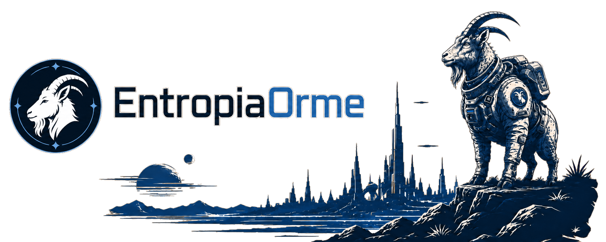

[](https://github.com/entropiaorme/entropiaorme/actions/workflows/ci.yml)
[](https://github.com/entropiaorme/entropiaorme/actions/workflows/ci.yml)
[](https://github.com/entropiaorme/entropiaorme/actions/workflows/nightly.yml)

An analytical desktop tool for Entropia Universe. Overview and installer downloads: **[entropiaorme.com](https://entropiaorme.com)**.

A Tauri 2 shell hosting a Svelte 5 frontend over a pure-Rust in-process backend. It runs on Windows and, experimentally, on Linux (Ubuntu on Wayland/GNOME, via XWayland); the OS-touching seams (input observation, screen capture, window discovery) are implemented per platform behind shared traits, and the Linux build is still being validated against the live game. The rest of this README covers building from source.

## Repository map

- `app/`: the application (SvelteKit frontend + the `src-tauri` Rust workspace)
- `docs/`: the mdBook architecture handbook and ADRs, published to GitHub Pages
- `scripts/`: build and launch scripts driven by the `justfile`
- `data/demo/`: the bundled demo database
- `assets/`: repository art

## Branches

Development happens on `next`; `main` is the stable line releases are cut from, and it moves only when `next` is promoted after its changes have been run in the installed application for a while. Build from `main` for stability, from `next` for the latest changes.

## Build (Windows)

Prerequisites: Node.js ≥ 20.19, Rust (`rustup`), Visual Studio Build Tools (MSVC C++ workload), Windows Terminal, [`just`](https://just.systems/) ≥ 1.34.

```bash
cd app && npm install && cd ..
pre-commit install   # local hooks mirroring the CI gates (see TESTING.md)
just dev             # hot-reload dev shell
just installer       # WiX Burn installer -> app/src-tauri/target/release/bundle/burn/
```

`just --list` shows the remaining recipes (`just check`, `just test-rust`, `just gen-ts`). The installer build additionally needs WiX 6 (the `wix` dotnet tool) and the MSVC x86 toolset; installer sources live under `app/src-tauri/entropia-orme/installer/`.

## Parallel checkouts

Give each checkout its own `.env.local` with a distinct `ENTROPIAORME_FRONTEND_PORT` and `ENTROPIAORME_DATA_DIR`; `just` loads it before every recipe. Optionally, [`direnv`](https://direnv.net/) activates it for ad-hoc shells (`direnv allow .` once per checkout).

## Documentation

- [Architecture handbook](docs/) and [ADRs](docs/src/adr/): published to GitHub Pages from `main` alongside the generated `cargo doc` API reference; `mdbook build docs` locally.
- [TESTING.md](TESTING.md): the test suite, the preserved equivalence evidence, and the CI gates.
- [SECURITY.md](SECURITY.md): the security policy, supply-chain review gates, and the release attestations (SBOM, checksums, build provenance).

## License

[MIT](LICENSE). Third-party components and their licenses: [THIRD-PARTY-NOTICES.md](THIRD-PARTY-NOTICES.md).
